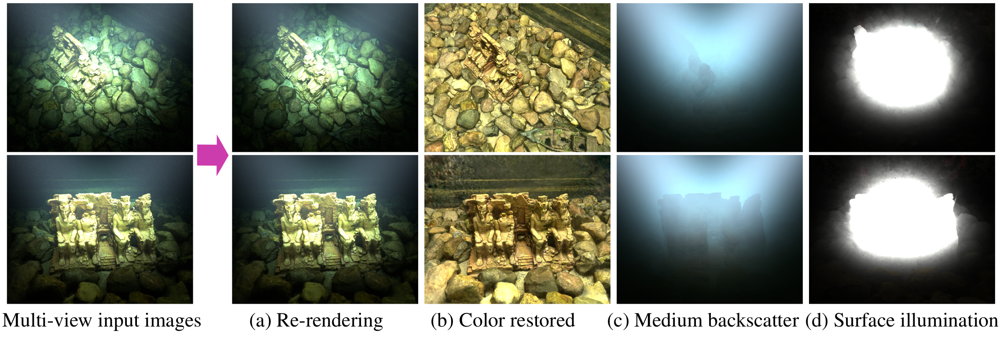

  <section style="text-align:center;">
    <h1>Relative Illumination Fields:<br>Learning Medium and Light Independent Underwater Scenes</h1>
    <div>
          <a href="https://orcid.org/0000-0001-9639-1680">Mengkun She*</a>&nbsp;
          <a href="https://orcid.org/0009-0002-6360-6635">Felix Seegräber*</a>&nbsp;
          <a href="https://orcid.org/0000-0001-6461-3357">David Nakath</a>&nbsp;
		  <a href="https://orcid.org/0000-0003-3404-8195">Patricia Schöntag</a>&nbsp;
		  <a href="https://orcid.org/0000-0002-0974-3834">Kevin Köser</a>&nbsp;
		  <p>(* denotes equal contribution)</p>
      </div>
  </section>

  <h3 style="text-align:center;">
  <a href="https://arxiv.org/abs/2504.10024">Paper</a> | Data (coming soon) |  <a href="https://mdskiel.github.io/relative-illumination/">Project Page</a>
  </h3>

<section style="text-align:center;">
<h1>Abstract</h1>
<p>We address the challenge of constructing a consistent and photorealistic Neural Radiance Field in inhomogeneously illuminated, scattering environments with unknown, co-moving light sources. While most existing works on underwater scene representation focus on a static homogeneous illumination, limited attention has been paid to  scenarios such as when a robot explores water deeper than a few tens of meters, where sunlight becomes insufficient. To address this, we propose a novel illumination field locally attached to the camera, enabling the capture of uneven lighting effects within the viewing frustum. We combine this with a volumetric medium representation to an overall method that effectively handles interaction between dynamic illumination field and static scattering medium. Evaluation results demonstrate the effectiveness and flexibility of our approach.</p>
</section>

<p style="text-align:center;">

</p>
<p style="text-align:center;">
&nbsp;&nbsp;

</p>

# Setup
## 1. Create a Conda environment and install Nerfstudio dependencies

Please follow the instructions to install **[Nerfstudio](https://docs.nerf.studio/quickstart/installation.html#)** and remember to also install`tiny-cuda-nn`.
As an example for our Ubuntu 22.04 system, we do the following:
```
# Create a conda environment
conda create --name rel-illum -y python=3.10.14
conda activate rel-illum
pip install --upgrade pip

# Install PyTorch
conda install pytorch==2.3.0 torchvision==0.18.0 torchaudio==2.3.0 pytorch-cuda=12.1 -c pytorch -c nvidia

# Install tiny-cuda-nn
pip install ninja git+https://github.com/NVlabs/tiny-cuda-nn/#subdirectory=bindings/torch

# Install Nerfstudio from pip
pip install nerfstudio

# (or) Install Nerfstudio from source
git clone https://github.com/nerfstudio-project/nerfstudio.git
cd nerfstudio
pip install --upgrade pip setuptools
pip install -e .

# For Tab completion
ns-install-cli
```

## 2. Clone the repository

```
git clone https://cau-git.rz.uni-kiel.de/inf-ag-koeser/relative-illumination
```

## 3. Install the repo to register with Nerfstudio

```
cd relative-illumination
pip install -e .
ns-install-cli
```

# Using Relative illumination
## 1. Check the help message from the method and dataloader:
```
ns-train relative-illumination --help
ns-train relative-illumination-big --help
ns-train relative-illumination colmap-raw --help
```

## 2. Train on rendered data
In our rendered data we provide the ground truth poses and camera intrinsics in colmap reconstruction format. Since data format is `.exr` and the reconstruction contains no 3D points, specify `colmap-raw --read_exr True --load_3D_points False` for the dataloader.

```
ns-train relative-illumination \
--data /path/to/data \
--output-dir /path/to/data/results \
--pipeline.model.model_medium True \
--pipeline.model.apply_srgb True \
colmap-raw \
--raw-path images \
--read_exr True \
--load_3D_points False
```
Notes:
- We find that for some datasets increasing the parameter `--pipeline.model.alpha_scale` to greater 1 yields improved results, usually this is not necessary though. 
- Set `pipeline.model.model_medium` to `True` for underwater data, `False` for in-air data.
- `pipeline.model.apply_srgb` will apply srgb to the final output. Is overriden in the viewer by the checkbox. Mostly relevant for rendering.

## 3. Train on real-world data
For real-world raw data we use the `RawNeRF` data convention of providing images in `.DNG` format with metadata in a `.json`. A `colmap` reconstruction is required, which we provide for our dataset.

```
ns-train relative-illumination \
--data /path/to/data \
--output-dir /path/to/data/results \
--pipeline.model.model_medium True \
--pipeline.model.apply_srgb True \
--pipeline.model.apply_color_transform
```
Notes:
- Similar to `apply_srgb`, `pipeline.model.apply_color_transform` controls whether to apply color transformation (read from raw metadata) to the final output. It is also overriden in the viewer by the checkbox and mostly relevant for rendering.

## 3. Render the clean representation of the scene
```
ns-render dataset \
--load-config /path/to/data/results/config.yml \
--output-path /path/to/data/results/render \
--split train+test \
--rendered-output-names rgb rgb_clean rgb_medium alpha_map
```

## 4. Evaluate the rendered test images
```
ns-eval --load-config /path/to/data/results/config.yml \
--output-path /path/to/data/results/metric.json
```

# References
If you found this work to be useful in your own research, please considering citing:
```
@article{she2025relativeillumination,
    title={Relative Illumination Fields: Learning Medium and Light Independent Underwater Scenes},
    author={Mengun She and Felix Seegräber and David Nakath and Patricia Schöntag and Kevin Köser},
    journal={ICCV},
    year={2025}
}
```

Software for generating the realistic synthetic underwater dataset

```
@software{Mitsuba3,
    title = {Mitsuba 3 renderer},
    author = {Wenzel Jakob and Sébastien Speierer and Nicolas Roussel and Merlin Nimier-David and Delio Vicini and Tizian Zeltner and Baptiste Nicolet and Miguel Crespo and Vincent Leroy and Ziyi Zhang},
    note = {https://mitsuba-renderer.org},
    version = {3.1.1},
    year = 2022
}
```
We implement the ideas proposed by RawNeRF as `rawnerfacto` and use it as the underlying NeRF model for training relative illumination field.
```
@article{mildenhall2022rawnerf,
    title={{NeRF} in the Dark: High Dynamic Range View Synthesis from Noisy Raw Images},
    author={Ben Mildenhall and Peter Hedman and Ricardo Martin-Brualla and Pratul P. Srinivasan and Jonathan T. Barron},
    journal={CVPR},
    year={2022}
}
```
